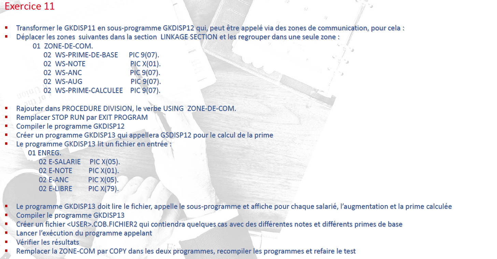

  

<h3 align="center">COBOL POE - Part 1</h3>

---

 Exercice 11
      

ex11-m.cbl is a MODULE of ex11.cbl  
So you have to compile it BEFORE ex11.cbl  

That's why I made 2 jcl-compilation. Execute them in order.

Also, You have to read a file, I propose something : file011.txt

  

